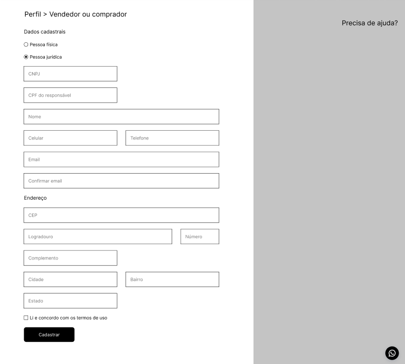

# WeFit - Desafio Backend

## Objetivo do Desafio

O objetivo deste desafio é criar um endpoint necessário para processar o cadastro de usuários através de um formulário, seguindo as boas práticas de desenvolvimento e garantindo o correto funcionamento da aplicação.

## Formulário de Cadastro

O formulário de cadastro possui os seguintes campos:



*Obs: A imagem acima representa o formulário de cadastro para o qual este backend foi desenvolvido.*

## Funcionalidades Implementadas

- Cadastro de pessoas físicas e jurídicas em uma única tabela
- Validação de dados de acordo com o tipo de pessoa (física ou jurídica)
- Verificação de unicidade para email, CPF e CNPJ
- Tratamento adequado de erros com mensagens descritivas
- Segurança básica com Spring Security

## Tecnologias Utilizadas

- Java 21
- Spring Boot 3.5.3
- Spring Data JPA
- Spring Security
- Spring Validation
- H2 Database (banco de dados em memória)
- Lombok

## Arquitetura

O projeto segue uma arquitetura em camadas:

- **Domain**: Contém as entidades, DTOs e enums que representam o domínio da aplicação
- **Application**: Contém os serviços que implementam a lógica de negócio
- **Infrastructure**: Contém os controladores, repositórios e configurações da aplicação

## Endpoints

### Cadastro de Usuário

```
POST /api/register
```

Este endpoint recebe os dados do usuário e realiza o cadastro, aplicando as validações necessárias.

## Exemplos de Requisição

### Cadastro de Pessoa Física

```json
{
  "email": "joao.silva@exemplo.com",
  "confirmEmail": "joao.silva@exemplo.com",
  "personType": "FISICA",
  "cpf": "12345678901",
  "fullName": "João Silva",
  "mobilePhone": "11999999999",
  "landlinePhone": "1122223333",
  "postalCode": "01234567",
  "street": "Rua das Flores",
  "number": "123",
  "complement": "Apto 101",
  "city": "São Paulo",
  "neighborhood": "Jardim Paulista",
  "state": "SP",
  "termsAccepted": true
}
```

### Cadastro de Pessoa Jurídica

```json
{
  "email": "contato@empresa.com.br",
  "confirmEmail": "contato@empresa.com.br",
  "personType": "JURIDICA",
  "cnpj": "12345678901234",
  "cpfResponsible": "12345678901",
  "fullName": "Empresa Exemplo Ltda",
  "mobilePhone": "11999999999",
  "landlinePhone": "1122223333",
  "postalCode": "01234567",
  "street": "Avenida Paulista",
  "number": "1000",
  "complement": "Sala 1010",
  "city": "São Paulo",
  "neighborhood": "Bela Vista",
  "state": "SP",
  "termsAccepted": true
}
```

## Validações

### Campos Obrigatórios para Todos os Usuários
- Email
- Confirmação de Email
- Tipo de Pessoa (FISICA ou JURIDICA)
- Nome Completo
- Telefone Celular
- CEP
- Rua
- Número
- Cidade
- Bairro
- Estado
- Aceitação dos Termos

### Validações Específicas para Pessoa Física
- CPF obrigatório e válido (11 dígitos)
- CNPJ e CPF do Responsável não devem ser informados

### Validações Específicas para Pessoa Jurídica
- CNPJ obrigatório e válido (14 dígitos)
- CPF do Responsável obrigatório e válido (11 dígitos)
- CPF não deve ser informado

## Erros e Respostas

### Sucesso
- **Código**: 200 OK
- **Corpo**: "User registered successfully"

### Erros de Validação
- **Código**: 400 Bad Request
- **Corpo**: JSON com os campos e mensagens de erro

### Erro de Conflito (dados já existentes)
- **Código**: 409 Conflict
- **Corpo**: Mensagem indicando qual dado já está cadastrado

## Como Executar

1. Clone o repositório
2. Execute o comando: `./mvnw spring-boot:run`
3. O servidor estará disponível em `http://localhost:8080`
4. Você pode acessar o console H2 em `http://localhost:8080/h2-console` (usuário: sa, senha: vazia)

## Considerações Finais

Este projeto foi desenvolvido como parte do desafio backend da WeFit, implementando um serviço de cadastro de usuários que suporta tanto pessoas físicas quanto jurídicas. A solução utiliza Spring Boot e segue boas práticas de desenvolvimento, incluindo validação de dados, tratamento de exceções e arquitetura em camadas.
